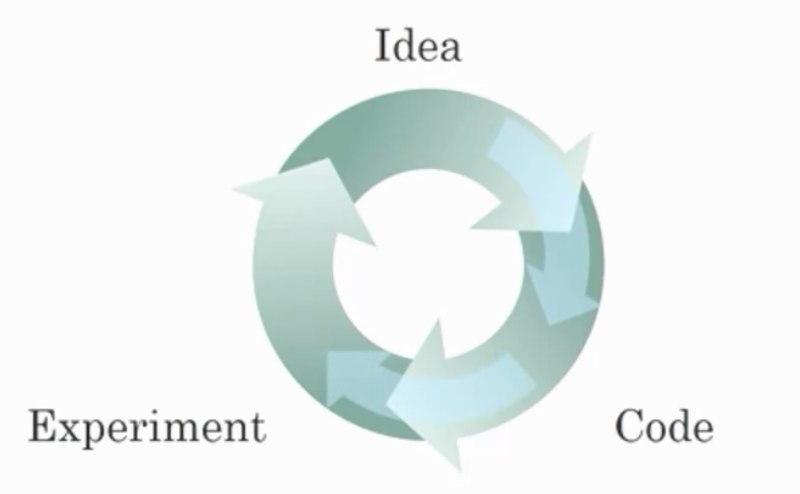
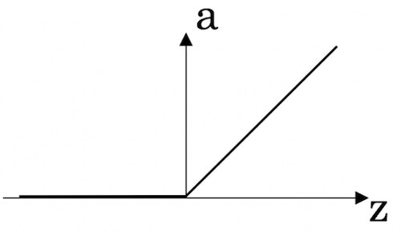
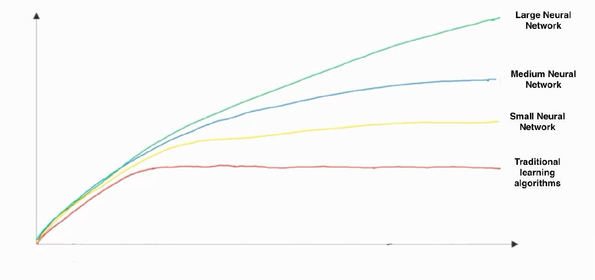

## Week 1 Quiz - Introduction to deep learning.md

1. What does the analogy “AI is the new electricity” refer to?

    - [ ] Through the “smart grid”, AI is delivering a new wave of electricity.
    - [x] Similar to electricity starting about 100 years ago, AI is transforming multiple industries.
    - [ ] AI is powering personal devices in our homes and offices, similar to electricity.
    - [ ] AI runs on computers and is thus powered by electricity, but it is letting computers do things not possible before.
    
    *Note: Andrew illustrated the same idea in the lecture.*

2. Which of these are reasons for Deep Learning recently taking off? (Check the three options that apply.)

    - [ ] Neural Networks are a brand new field.
    - [x] We have access to a lot more data.
    - [x] Deep learning has resulted in significant improvements in important applications such as online advertising, speech recognition, and image recognition.
    - [x] We have access to a lot more computational power.

3. Recall this diagram of iterating over different ML ideas. Which of the statements below are true? (Check all that apply.)

    

    - [x] Being able to try out ideas quickly allows deep learning engineers to iterate more quickly.
    - [x] Faster computation can help speed up how long a team takes to iterate to a good idea.
    - [ ] It is faster to train on a big dataset than a small dataset.
    - [x] Recent progress in deep learning algorithms has allowed us to train good models faster (even without changing the CPU/GPU hardware).

4. When an experienced deep learning engineer works on a new problem, they can usually use insight from previous problems to train a good model on the first try, without needing to iterate multiple times through different models. True/False?

    - [ ] True
    - [x] False
    
    *Note: Maybe some experience may help, but nobody can always find the best model or hyperparameters without iterations.*
    
5. Which one of these plots represents a ReLU activation function?

    - 

6. Images for cat recognition is an example of “structured” data, because it is represented as a structured array in a computer. True/False?

    - [ ] True
    - [x] False

7. A demographic dataset with statistics on different cities' population, GDP per capita, economic growth is an example of “unstructured” data because it contains data coming from different sources. True/False?

    - [ ] True
    - [x] False

8. Why is an RNN (Recurrent Neural Network) used for machine translation, say translating English to French? (Check all that apply.)

    - [x] It can be trained as a supervised learning problem.
    - [ ] It is strictly more powerful than a Convolutional Neural Network (CNN).
    - [x] It is applicable when the input/output is a sequence (e.g., a sequence of words).
    - [ ] RNNs represent the recurrent process of Idea->Code->Experiment->Idea->....

9. In this diagram which we hand-drew in lecture, what do the horizontal axis (x-axis) and vertical axis (y-axis) represent?

    
    
    - x-axis is the amount of data
    - y-axis (vertical axis) is the performance of the algorithm.

10. Assuming the trends described in the previous question's figure are accurate (and hoping you got the axis labels right), which of the following are true? (Check all that apply.)

    - [ ] Decreasing the size of a neural network generally does not hurt an algorithm’s performance, and it may help significantly.
    - [ ] Decreasing the training set size generally does not hurt an algorithm’s performance, and it may help significantly.
    - [x] Increasing the training set size generally does not hurt an algorithm’s performance, and it may help significantly.
    - [x] Increasing the size of a neural network generally does not hurt an algorithm’s performance, and it may help significantly.
